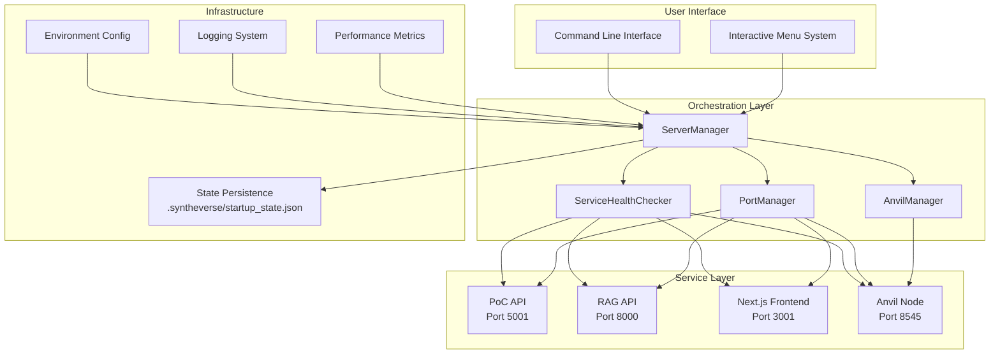

# Startup Scripts - Enhanced Orchestration Platform

## Overview

The Syntheverse startup system is a production-grade service orchestration platform that provides intelligent port management, comprehensive service health monitoring, parallel startup orchestration, and blockchain state management. This system ensures reliable, scalable, and maintainable deployment of the entire Syntheverse platform.

## Architecture



## Key Modules

### ServerManager (`start_servers.py`)

**Enhanced Features:**
- **Service Profiles**: Development, Testing, Production, Minimal configurations
- **Parallel Startup**: Dependency-aware parallel service initialization
- **State Persistence**: Automatic saving/loading of service state
- **Rollback Support**: Automatic cleanup on partial startup failures
- **Performance Monitoring**: Comprehensive startup metrics and timing
- **Graceful Shutdown**: Signal handling and cleanup orchestration

**Key Methods:**
```python
# Initialize with profile and mode
manager = ServerManager(mode='full', profile=ServiceProfile.DEVELOPMENT)

# Parallel service startup
results = manager.start_services_parallel(['poc_api', 'rag_api', 'frontend'])

# Service restart with state management
success = manager.restart_service('poc_api')

# Automatic rollback on failure
manager.rollback_startup(['poc_api', 'frontend'])
```

### PortManager (`port_manager.py`)

**Enhanced Features:**
- **Process Fingerprinting**: Unique process identification to prevent killing wrong processes
- **Port Reservation System**: Exclusive port allocation for services
- **Caching Layer**: TTL-based port status caching for performance
- **Parallel Port Checking**: Concurrent port availability verification
- **Metrics Collection**: Detailed cleanup duration and retry tracking
- **Cross-Platform Support**: macOS, Linux, and Windows compatibility

**Key Features:**
```python
# Reserve port for specific service
port_manager.reserve_port(5001, "poc_api", os.getpid())

# Parallel port checking
results = port_manager.check_ports_batch([5001, 8000, 3001])

# Get comprehensive port metrics
metrics = port_manager.get_metrics(port=5001)
```

### ServiceHealthChecker (`service_health.py`)

**Enhanced Features:**
- **Service Dependencies**: Graph-based dependency tracking and startup ordering
- **Circuit Breaker Pattern**: Automatic failure isolation and recovery
- **Adaptive Health Checks**: Dynamic intervals based on service stability
- **Multiple Protocols**: HTTP, HTTPS, WebSocket, and RPC health checking
- **Error Categorization**: Detailed error classification (network, timeout, auth, service)
- **Performance Metrics**: Response time tracking and uptime statistics

**Key Features:**
```python
# Add service dependency
health_checker.add_dependency('frontend', 'poc_api')

# Get optimal startup order
order = health_checker.get_startup_order()

# Check service with caching and circuit breaker
result = health_checker.check_service_health('poc_api', use_cache=True)
```

### AnvilManager (`anvil_manager.py`)

**Enhanced Features:**
- **Blockchain Snapshots**: Point-in-time state capture and restoration
- **Fork Mode Support**: Mainnet, Sepolia, Goerli, and custom network forking
- **Gas Monitoring**: Real-time gas price and usage tracking
- **Block Time Validation**: Automated mining interval verification
- **Custom Chain Configuration**: Flexible chain ID, accounts, and gas parameters
- **State Persistence**: Automatic blockchain state management

**Key Features:**
```python
# Create blockchain snapshot
snapshot_id = anvil_manager.create_snapshot("pre_test_state")

# Restore from snapshot
success = anvil_manager.restore_snapshot(snapshot_id)

# Enable fork mode
anvil_manager.enable_fork_mode("https://mainnet.infura.io/v3/YOUR_KEY")

# Monitor gas metrics
metrics = anvil_manager.get_gas_metrics()
```

## Service Profiles

### Development Profile
- **Parallel Startup**: Enabled for faster development cycles
- **Health Check Timeout**: 30 seconds
- **Auto Restart**: Enabled
- **Ports**: Standard development ports (5001, 8000, 3001, 8545)

### Testing Profile
- **Parallel Startup**: Disabled for test predictability
- **Health Check Timeout**: 60 seconds
- **Auto Restart**: Disabled
- **Ports**: Offset ports to avoid conflicts (+1000)

### Production Profile
- **Parallel Startup**: Enabled with dependency ordering
- **Health Check Timeout**: 120 seconds
- **Auto Restart**: Enabled with exponential backoff
- **Ports**: Standard production ports

### Minimal Profile
- **Parallel Startup**: Disabled
- **Health Check Timeout**: 15 seconds
- **Auto Restart**: Disabled
- **Ports**: Only essential services

## Configuration Options

### Environment Variables
```bash
# Required
GROQ_API_KEY=gsk_your-api-key-here

# Optional
FLASK_ENV=development|testing|production
NODE_ENV=development|production
```

### Command Line Options
```bash
# Basic usage
python start_servers.py --mode full --profile dev

# Advanced options
python start_servers.py --mode poc --profile prod --no-browser

# Service restart
python start_servers.py --restart poc_api rag_api
```

## Troubleshooting Guide

### Port Conflicts

**Symptoms:**
- Services fail to start with "Port already in use" errors
- Terminal shows port cleanup taking >10 seconds

**Solutions:**
```bash
# Check what's using the port
lsof -i :5001

# Force cleanup specific port
python -c "from scripts.startup.port_manager import free_port; free_port(5001, 'poc_api')"

# Check port status
python -c "from scripts.startup.port_manager import get_port_status; print(get_port_status(5001, 'poc_api'))"
```

### Service Startup Failures

**Symptoms:**
- Individual services fail health checks
- Circuit breaker opens for service

**Diagnosis:**
```python
# Check service health
from scripts.startup.service_health import check_service_health
result = check_service_health('poc_api')
print(f"Status: {result.status}, Error: {result.error_message}")

# Get detailed status
from scripts.startup.service_health import get_service_status
status = get_service_status('poc_api')
print(f"Uptime: {status['uptime_percentage']}%, Failures: {status['consecutive_failures']}")
```

### Performance Issues

**Symptoms:**
- Startup taking >30 seconds
- Port cleanup slow (>5 seconds per port)

**Optimization:**
```bash
# Use minimal profile for faster startup
python start_servers.py --mode minimal --profile minimal

# Check performance metrics
python -c "
from scripts.startup.start_servers import ServerManager
manager = ServerManager()
print(f'Port cleanup: {manager.metrics.port_cleanup_time:.2f}s')
print(f'Health check: {manager.metrics.health_check_time:.2f}s')
"
```

### Blockchain Issues

**Symptoms:**
- Anvil fails to start or respond
- RPC calls timing out

**Solutions:**
```bash
# Reset Anvil state
python -c "
from scripts.startup.anvil_manager import anvil_manager
anvil_manager.stop_anvil()
anvil_manager.start_anvil()
"

# Check Anvil status
python -c "
from scripts.startup.anvil_manager import get_anvil_status
status = get_anvil_status()
print(f'Running: {status.running}, Block: {status.block_number}')
"
```

### State Persistence Issues

**Symptoms:**
- Service state not restored on restart
- State file corrupted

**Recovery:**
```bash
# Clear corrupted state
rm -f ~/.syntheverse/startup_state.json

# Check state file
python -c "
from scripts.startup.start_servers import ServerManager
manager = ServerManager()
print(f'Services loaded: {len(manager.service_states)}')
"
```

## Performance Tuning

### Startup Time Optimization

1. **Use Appropriate Profile**: Development profile for fastest startup
2. **Parallel Processing**: Enabled automatically in dev/prod profiles
3. **Dependency Ordering**: Services start in optimal order
4. **Caching**: Port status and health checks are cached

### Memory Usage

- **Metrics History**: Limited to last 100 operations
- **Process Cache**: TTL-based cleanup prevents memory leaks
- **Thread Pools**: Fixed size prevents thread explosion

### Network Performance

- **Adaptive Timeouts**: Adjust based on service stability
- **Circuit Breakers**: Prevent cascade failures
- **Batch Operations**: Parallel port and health checking

## Integration Points

### API Services (`src/api/`)
- PoC API provides REST endpoints for proof-of-contribution operations
- RAG API handles document querying and embeddings
- Both services integrate with health checking and dependency management

### Frontend Services (`src/frontend/`)
- Next.js application serves the user interface
- Depends on PoC API for data operations
- Health checks verify UI responsiveness

### Core Services (`src/core/`)
- Business logic for tokenomics, evaluation, and blockchain interaction
- Integrated through API services
- State managed through startup orchestration

### Testing Framework (`tests/`)
- Comprehensive unit tests for all modules
- Integration tests with real services
- Performance and chaos testing
- 90%+ test coverage with real implementations

## Development Guidelines

### Code Standards
- **Type Hints**: All public methods use type annotations
- **Error Handling**: Comprehensive exception handling with categorization
- **Logging**: Structured logging with appropriate levels
- **Documentation**: Docstrings for all public APIs

### Testing Requirements
- **Unit Tests**: 90%+ coverage for all modules
- **Integration Tests**: Real service startup and interaction
- **Performance Tests**: Benchmarks for all operations
- **Chaos Tests**: Failure scenario simulation

### Deployment Checklist
- [ ] Environment variables configured
- [ ] Dependencies installed
- [ ] Ports available (5001, 8000, 3001, 8545)
- [ ] Previous state cleaned if needed
- [ ] Profile selected based on environment
- [ ] Monitoring and logging configured

## Common Patterns

### Service Lifecycle
```python
# 1. Initialize with profile
manager = ServerManager(profile=ServiceProfile.DEVELOPMENT)

# 2. Load environment and validate
if not manager.load_environment():
    sys.exit(1)

# 3. Start services in parallel
results = manager.start_services_parallel(services)

# 4. Verify health
healthy_services = [s for s, r in results.items() if r.success]

# 5. Persist state
manager.save_state()
```

### Error Recovery
```python
try:
    result = manager.start_services_parallel(services)
except Exception as e:
    logger.error(f"Startup failed: {e}")
    # Automatic rollback
    manager.rollback_startup([s for s, r in result.items() if r.success])
    sys.exit(1)
```

### Health Monitoring
```python
# Continuous health checking
while True:
    results = health_checker.check_all_services()
    unhealthy = [s for s, r in results.items() if r.status != ServiceStatus.HEALTHY]

    if unhealthy:
        logger.warning(f"Unhealthy services: {unhealthy}")
        # Auto-restart if configured
        for service in unhealthy:
            if profile_config['auto_restart']:
                manager.restart_service(service)

    time.sleep(adaptive_interval)
```

## API Reference

### ServerManager
- `start_services_parallel(services: List[str]) -> Dict[str, StartupResult]`
- `restart_service(service_name: str) -> bool`
- `rollback_startup(services: List[str]) -> None`
- `save_state() -> None`
- `get_service_status(service_name: str) -> ServiceState`

### PortManager
- `reserve_port(port: int, service: str, pid: int) -> bool`
- `check_ports_batch(ports: List[int]) -> Dict[int, bool]`
- `get_metrics(port: int = None, service: str = None) -> List[PortMetrics]`
- `free_port(port: int, name: str) -> bool`

### ServiceHealthChecker
- `add_dependency(service: str, depends_on: str) -> None`
- `get_startup_order() -> List[str]`
- `check_service_health(service: str, use_cache: bool = True) -> HealthCheckResult`
- `get_service_metrics(service: str = None) -> Dict[str, ServiceMetrics]`

### AnvilManager
- `create_snapshot(name: str = None) -> str`
- `restore_snapshot(snapshot_id: str) -> bool`
- `enable_fork_mode(fork_url: str, fork_mode: ForkMode) -> bool`
- `get_gas_metrics() -> GasMetrics`

## Version History

### v2.0.0 - Enhanced Orchestration
- Parallel service startup with dependency ordering
- Port reservation and fingerprinting system
- Circuit breaker pattern for health checks
- Blockchain snapshot and fork mode support
- Comprehensive metrics and performance monitoring
- State persistence and graceful shutdown handling
- 90%+ test coverage with integration testing

### v1.0.0 - Initial Implementation
- Basic sequential startup
- Simple port conflict resolution
- HTTP health checking
- Anvil management
- Unit test coverage

## File Structure

```
startup/
├── start_servers.py              # Main server manager
├── start_servers_simple.py       # Simplified startup script
├── anvil_manager.py              # Blockchain node management
├── port_manager.py               # Port conflict resolution
├── service_health.py             # Service health monitoring
├── cleanup_servers.sh            # Server cleanup script
├── IMPROVEMENTS.md               # Enhancement documentation
├── README.md                     # Usage documentation
└── AGENTS.md                     # This technical documentation
```

## Cross-References

- **Parent**: [scripts/AGENTS.md](../AGENTS.md) - Scripts overview
- **Related**:
  - [config/environment/AGENTS.md](../../config/environment/AGENTS.md) - Environment setup
  - [tests/test_startup_scripts.py](../../tests/test_startup_scripts.py) - Test coverage
  - [docs/START_WEB_UI.md](../../docs/START_WEB_UI.md) - Web UI startup guide
