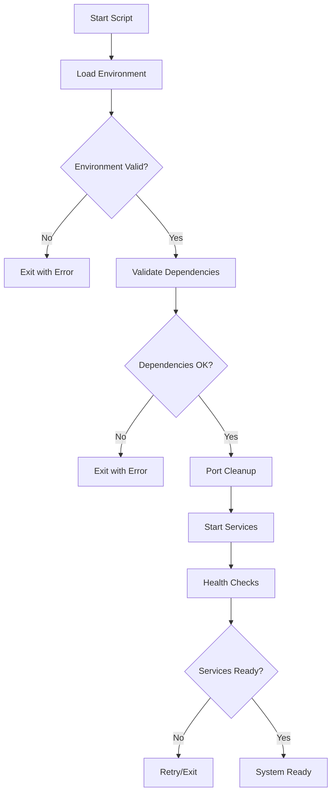
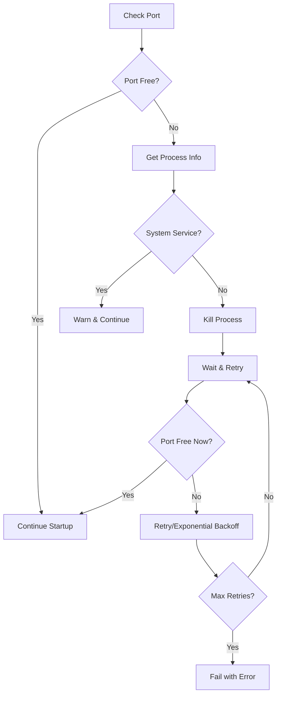

# Startup Scripts

## Purpose

Scripts to start the complete Syntheverse system, orchestrating all services and components.

## Scripts

- **`start_servers.py`**: Main startup script with multiple modes
  - `full`: All services (default)
  - `poc`: PoC API + Frontend
  - `minimal`: PoC API only
- **`port_manager.py`**: Port conflict resolution and management
- **`anvil_manager.py`**: Anvil blockchain node management
- **`service_health.py`**: Service health monitoring

## Usage

### Startup with Different Modes

```bash
# Start all services (default)
python scripts/startup/start_servers.py

# Start only PoC system (API + Frontend)
python scripts/startup/start_servers.py --mode poc

# Start minimal system (PoC API only)
python scripts/startup/start_servers.py --mode minimal

# Start without opening browser
python scripts/startup/start_servers.py --no-browser
```

## Services Started

- PoC API (Flask) on port 5001
- PoC Frontend (Next.js) on port 3001
- Legacy Web UI (Flask) on port 5000 (optional)
- Local Blockchain (Anvil) on port 8545 (if running)

## Prerequisites

### Required Software

- **Python 3.8+** with pip
- **Node.js 18+** with npm (required for Next.js frontend)
- **GROQ API Key** configured

### Environment Setup

Create a `.env` file in the project root:

```bash
# Syntheverse Environment Configuration

# GROQ API Configuration
GROQ_API_KEY=gsk_your-api-key-here

# Optional: Other API keys and configuration can go here
# OPENAI_API_KEY=your-openai-key-here
# ANVIL_RPC_URL=http://localhost:8545
```

Or set environment variables directly:

```bash
export GROQ_API_KEY=your-api-key-here
```

### Python Dependencies

Install required Python packages:

```bash
pip install flask flask-cors werkzeug requests
```

### Node.js Dependencies (for Next.js frontend)

```bash
cd src/frontend/poc-frontend
npm install
```

## Port Management

### Port Cleanup Behavior

All startup scripts use a shared `port_manager.py` module that provides intelligent port management:

- **Automatic Port Detection**: Uses `lsof` to identify processes using target ports
- **Smart Process Killing**: Attempts to kill processes gracefully with SIGTERM, then SIGKILL if needed
- **System Service Protection**: Detects and warns about system services (like macOS AirPlay Receiver) without killing them
- **Retry Logic**: Implements exponential backoff retry (up to 5 attempts) for stubborn port conflicts
- **Multiple PID Handling**: Can handle multiple processes using the same port

### macOS AirPlay Receiver Workaround

On macOS, you may encounter conflicts with the AirPlay Receiver service on port 5000:

```
⚠️ Port 5000 (Web UI) in use - attempting force cleanup
⚠️ Not killing system service AirPlay (PID: 12345) on port 5000
⚠️ Left 1 system services running on port 5000
```

**Solutions:**
1. **Use different port**: Modify the `ports` dictionary in startup scripts to use port 5002 instead
2. **Disable AirPlay Receiver**: System Preferences → Sharing → Uncheck "AirPlay Receiver"
3. **Manual port change**: The script will continue and use a different port if configured

## Testing

### Unit Tests

Run port management tests:
```bash
cd tests
python -m pytest test_port_manager.py -v
```

### Startup Script Tests

Run comprehensive startup script tests:
```bash
cd tests
python -m pytest test_startup_scripts.py -v
```

### Test Coverage

Tests cover:
- Port availability checking
- Process detection and killing
- System service identification
- Environment variable loading
- Dependency validation
- Service health checks
- Error handling and recovery

## Architecture

### Startup Flow Diagram



### Port Management Flow



## Troubleshooting

### Common Issues

#### "Required file not found" errors

The startup scripts validate that required files exist before starting services. If you see:

```
❌ Required file not found: /path/to/file
```

This indicates a file is missing. Ensure you're running the script from the project root directory.

#### "Missing required environment variables"

```
❌ Missing required environment variables: GROQ_API_KEY
```

Set the GROQ_API_KEY in your `.env` file or environment variables.

#### "Port X is still in use" warnings

The scripts use intelligent port management with retry logic and system service detection. If automatic cleanup fails:

**Manual Intervention:**
```bash
# Find process using the port
lsof -i :5000

# Kill the process (replace PID)
kill -9 PID
```

**Alternative Solutions:**
- Use a different port by modifying the `ports` dictionary in the startup script
- Restart your computer to clear system services
- Check for background processes: `ps aux | grep -E "(python|node|flask)"`

**Common macOS Issues:**
- AirPlay Receiver on port 5000: Disable in System Preferences → Sharing
- Control Center processes: May require restart or different port selection

#### Next.js frontend not starting

```
❌ Node.js not available - Next.js frontend cannot start
```

Ensure Node.js 18+ is installed and available in PATH.

#### Python packages missing

```
❌ Missing Python packages: flask, flask_cors
```

Install missing packages:

```bash
pip install flask flask-cors werkzeug requests
```

### Service Health Checks

The startup scripts perform health checks after starting services. If a service fails:

1. Check the service logs (displayed in terminal)
2. Verify the service is running: `ps aux | grep python`
3. Check service endpoints manually:
   - PoC API: `curl http://localhost:5001/health`
   - Web UI: `curl http://localhost:5000/`
   - Next.js: `curl http://localhost:3001/`

### Port Conflicts

Default ports used:
- PoC API (Flask): 5001
- Legacy Web UI (Flask): 5000
- Next.js Frontend: 3001
- Anvil (blockchain): 8545

To use different ports, modify the `ports` dictionary in the startup scripts.

## Integration

- Orchestrates system services: Manages Flask API, Next.js frontend, and RAG API
- Port management: Shared `port_manager.py` handles conflicts across all scripts
- Service lifecycle management: Startup, monitoring, and shutdown
- Error handling: Logging and actionable error messages
- Health checks with retry logic: Exponential backoff for service availability
- Dependency validation: Pre-flight checks prevent startup failures
- Cross-platform compatibility: Works on macOS, Linux, and Windows
- Testing: Test coverage for reliability

## Development

### Adding New Startup Scripts

1. Import the shared `PortManager` class
2. Use `port_manager.free_port()` instead of manual port checking
3. Implement proper logging with the test framework
4. Add comprehensive error handling
5. Include health checks with retry logic

### Port Configuration

Modify the `ports` dictionary in startup scripts to change default ports:

```python
self.ports = {
    'api': 5001,      # Flask PoC API
    'frontend': 3001  # Next.js frontend
}
```

### Testing New Scripts

Add tests to `test_startup_scripts.py` following the existing patterns:
- Test environment loading
- Test dependency validation
- Test service startup with mocks
- Test error conditions

